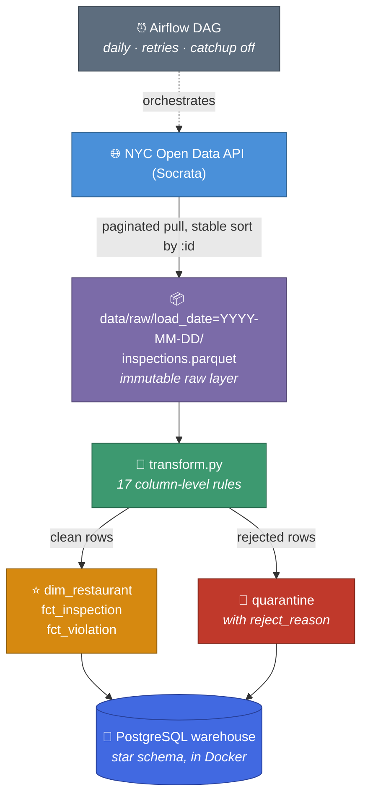

# 🍕 NYC Restaurant Inspections Data Pipeline

> An end-to-end data pipeline over NYC's Department of Health restaurant
> inspection data — extracts from the NYC Open Data API into an immutable raw
> layer, applies documented cleaning rules, quarantines rows that fail
> validation, and loads a star schema into PostgreSQL. Orchestrated with
> Airflow, containerized with Docker.

## 🛠️Tools:


## 📋Breakdown:

| | |
|---|---|
| **Records processed** | ~290,000 |
| **Restaurants** | 31,355 |
| **Inspections** | 96,585 |
| **Cleaning rules** | 17 column-level |
| **Runtime** | under a minute, end to end |
| **Setup** | one command (`docker compose up -d`) |

---

## 🎯 Why this dataset

The DOHMH inspection feed covers roughly **31,000 restaurants** and **97,000
inspections**, and arrives at *violation* grain — one row per violation, so a
single inspection with four violations appears four times.

It also ships with real data quality problems, which is what makes it a good
test of the parts of data engineering that actually matter:

- Sentinel dates (`1900-01-01`) standing in for never-inspected restaurants
- Placeholder borough codes (`'0'`)
- Malformed phone numbers
- Coordinates at `(0, 0)`
- Nested JSON objects that break deduplication

---

## 🏗️ Architecture



---

## 🗂️ Data model

| Table | Grain | Rows |
|---|---|---:|
| `dim_restaurant` | one row per `camis` (restaurant) | ~31,400 |
| `fct_inspection` | one row per camis + date + program + type | ~96,600 |
| `fct_violation` | one row per violation | ~288,000 |
| `quarantine` | one row per rejected record, with reason | varies |

<details>
<summary><b>Two design decisions worth calling out</b></summary>

<br>

**Surrogate keys plus a unique index.** Restaurants awaiting their first
inspection have a null `inspection_date`, and PostgreSQL rejects nulls in a
primary key. Rather than inventing a sentinel date or dropping those rows,
`fct_inspection` uses a surrogate key for row identity and enforces the real
business grain with a unique index using `NULLS NOT DISTINCT`, so duplicate
uninspected rows are still blocked.

**Constraints enforced twice.** The cleaning rules run in pandas, and the same
rules exist as `CHECK` constraints in the schema. If a future code change
breaks a rule, the load fails rather than quietly writing bad data.

</details>

---

## 🧹 Data quality approach

| Principle | What it means here |
|---|---|
| **Nulls over placeholders** | A score of `0` is the *best* possible score, so filling nulls would make uninspected restaurants look spotless |
| **Sentinels become nulls** | `boro = '0'`, coordinates at `(0,0)`, and phones like `__________` are missing values in disguise |
| **Quarantine, not deletion** | Untrustworthy rows are routed to a table with a `reject_reason` and the original record as JSONB |
| **Row reconciliation** | The pipeline asserts `clean + quarantined + duplicates == source rows` before loading anything |

The 1900-dated rows are the exception to the sentinel rule: they flag
`is_uninspected` and are **kept**, because those are real restaurants that
simply have not been inspected yet. Restaurant names follow the same instinct —
a missing name is backfilled from another row for the same `camis` if one
exists, and left null otherwise. Never invented.

<details>
<summary><b>Full cleaning rules (17 columns)</b></summary>

<br>

| Column | Rule |
|---|---|
| `camis` | String, digits only. Non-numeric → null → quarantined |
| `dba` | Trimmed, uppercased, backfilled from same `camis`; never invented |
| `boro` | Five valid boroughs only; `'0'` and unknowns → null |
| `zipcode` | 5-digit string; anything else → null, then backfilled by `camis` |
| `phone` | Digits only; exactly 10 → `xxx-xxx-xxxx`, else null |
| `latitude` / `longitude` | Numeric; `0` or outside the NYC bounding box → both nulled |
| `inspection_date` | Datetime; `1900-01-01` → `is_uninspected = true`, date nulled |
| `inspection_type` | Split into `inspection_program` + `inspection_type` |
| `action` | Trimmed; derives `is_closed` for DOHMH closures |
| `score` | Numeric; negatives → null. Nulls never filled |
| `grade` | `A`, `B`, `C`, `N`, `P`, `Z` only; anything else → null |
| `violation_code` | Null means "inspection with no violations" — kept, not dropped |
| `critical_flag` | Three known values only; derives boolean `is_critical` |

</details>

---

## 📊 Findings

### 🗽 Grade distribution by borough

| Borough | A | B | C | Graded inspections | % A |
|---|---:|---:|---:|---:|---:|
| Manhattan | 17,430 | 1,440 | 769 | 19,639 | **88.8** |
| Staten Island | 1,565 | 154 | 52 | 1,771 | **88.4** |
| Brooklyn | 11,539 | 1,085 | 572 | 13,196 | **87.4** |
| Bronx | 4,124 | 491 | 210 | 4,825 | **85.5** |
| Queens | 9,874 | 1,163 | 645 | 11,682 | **84.5** |

> A grades dominate citywide, ranging from 84.5% in Queens to 88.8% in
> Manhattan — a spread of just over 4 percentage points. Inspection outcomes
> are far more uniform across boroughs than restaurant density is: Manhattan
> accounts for 38% of all graded inspections and Staten Island for 3%, yet
> their A rates sit within half a point of each other.

### ⚠️ Most-cited critical violations

| Code | Violation | Times cited | % of critical |
|---|---|---:|---:|
| `02G` | Cold food held above 41°F (smoked fish above 38°F) | 18,939 | 12.2 |
| `06C` | Food not protected from contamination during storage or prep | 18,859 | 12.2 |
| `06D` | Food contact surface not properly washed and sanitized | 18,537 | 12.0 |
| `02B` | Hot food item not held at or above 140°F | 15,502 | 10.0 |
| `04L` | Evidence of mice or live mice | 14,000 | 9.1 |
| `04N` | Evidence of roaches or live roaches | 11,245 | 7.3 |
| `04A` | Food Protection Certificate not held by manager | 7,791 | 5.0 |
| `04H` | Raw or prepared food adulterated or contaminated | 6,231 | 4.0 |
| `05D` | Hand washing facility not provided or improperly equipped | 5,540 | 3.6 |
| `06F` | Wiping cloths not stored clean, dry, or in sanitizer | 5,377 | 3.5 |

> The top four violations account for **46% of all critical citations**, and
> three of them are temperature or sanitation control failures rather than pest
> or structural problems. That distribution matters for policy: the most common
> critical issues are procedural and correctable through staff training, unlike
> the pest violations (`04L`, `04N`) just below them, which typically require
> remediation work.

### 🍽️ Average inspection score by cuisine type

Higher scores mean *worse* inspections. Limited to cuisines with at least 50
distinct restaurants, so a handful of poor inspections at a rare cuisine type
cannot skew the ranking.

| Cuisine | Restaurants | Inspections | Avg score | % A |
|---|---:|---:|---:|---:|
| Bangladeshi | 82 | 353 | 31.3 | 54.8 |
| African | 91 | 305 | 25.9 | 62.9 |
| Indian | 322 | 1,003 | 23.2 | 70.6 |
| Caribbean | 737 | 2,706 | 21.6 | 77.9 |
| Soul Food | 64 | 203 | 21.6 | 80.2 |
| Turkish | 78 | 225 | 21.4 | 85.2 |
| Latin American | 1,113 | 3,703 | 21.3 | 78.4 |
| Thai | 348 | 1,076 | 21.2 | 75.8 |
| Chinese | 2,271 | 7,240 | 21.2 | 77.8 |
| Eastern European | 129 | 376 | 21.2 | 82.8 |

> Average score and A rate do not move together as tightly as expected. Turkish
> restaurants average 21.4 — mid-table — yet earn an A on 85.2% of graded
> inspections, while Thai restaurants at a nearly identical 21.2 average earn
> an A only 75.8% of the time. The gap reflects distribution rather than central
> tendency: a cuisine can have a similar mean while more of its inspections
> fall just past the A threshold of 13 points.

⚠️ **A caveat on reading this table.** Cuisine type is a restaurant attribute,
not a cause. These groupings correlate with establishment size, kitchen
configuration, neighborhood, and the age of the building stock — none of which
are in this dataset. The table shows where scores cluster, not why.

### 📈 Do restaurants improve after a poor grade?

| Starting grade | Inspections with a follow-up | Improved to A | % to A |
|---|---:|---:|---:|
| B | 2,330 | 1,724 | **74.0** |
| C | 1,581 | 1,059 | **67.0** |

> **Most restaurants recover.** Two thirds of C-graded restaurants and nearly
> three quarters of B-graded ones earn an A on their next graded inspection.
> The 7-point gap between them is smaller than expected — a C does not appear
> to signal a fundamentally different kind of establishment from a B, just a
> worse day or a slower fix.
>
> The reverse framing is the more useful one for enforcement: **a third of
> C-graded restaurants do not reach an A on their next inspection.** That group
> — roughly 520 establishments — is where repeat problems concentrate, and it
> is a far more targetable population than any borough or cuisine cut above.

⚠️ *Caveat:* this measures the next **graded** inspection, which is often a
scheduled re-inspection rather than a routine cycle inspection, so the interval
between them varies.

---

## 🚀 Running it

**Prerequisites:** Docker Desktop, and a free
[NYC Open Data app token](https://data.cityofnewyork.us/profile/edit/developer_settings).

```bash
git clone https://github.com/Salrocks/nyc-restaurant-inspections.git

cd nyc-restaurant-inspections

cp .env.example .env        # then fill in credentials and your app token

docker compose up -d        # Postgres warehouse + Airflow metadata DB + Airflow
```

The schema is applied automatically on first startup. Airflow is at
**http://localhost:8080** — the generated admin password is at
`/opt/airflow/simple_auth_manager_passwords.json.generated` inside the
container.

Unpause `nyc_inspections_pipeline` and trigger a run, or run the steps directly:

```bash
python extract.py     # API → data/raw/load_date=YYYY-MM-DD/
python transform.py   # cleaning + modeling (prints table shapes)
python load.py        # → PostgreSQL
```

Query the warehouse:

```bash
docker compose exec -T postgres psql -U nyc_admin -d nyc_inspections \
  < sql/analysis/01.sql
```

---

## 📁 Project layout

```
.
├── dags/inspections_dag.py      # Airflow DAG: extract → transform → load
├── extract.py                   # paginated Socrata pull → partitioned Parquet
├── transform.py                 # cleaning rules, quarantine, dimensional model
├── load.py                      # idempotent load into PostgreSQL
├── sql/
│   ├── schema.sql               # tables, constraints, indexes (auto-applied)
│   └── analysis/                # findings queries
├── docker-compose.yml           # warehouse + Airflow metadata DB + Airflow
├── Dockerfile                   # Airflow image with project dependencies
└── requirements.txt
```

---

## 🧠 Design decisions

<details>
<summary><b>Why full reload rather than incremental</b></summary>

<br>

The source is a ~290K-row snapshot that the city restates rather than appends
to, and a full rebuild completes in under a minute while guaranteeing the
warehouse matches the source with no drift. The load runs in a single
transaction, so a mid-run failure rolls back and leaves the previous data
intact rather than an empty warehouse.

Unique indexes on both fact grains are already in place, so switching to
`INSERT ... ON CONFLICT DO UPDATE` is a contained change if volume grows. The
watermark would come from `inspection_date` with a lookback window, since
`record_date` in this dataset reflects extract time rather than record change
time.

</details>

<details>
<summary><b>Why the raw layer is immutable</b></summary>

<br>

Each run writes its own dated Parquet partition, untouched from the API —
nested objects and all. Any cleaning bug can be diagnosed by re-running the
transform against an earlier partition, with no need to re-hit the API.

</details>

<details>
<summary><b>Why Airflow gets its own database</b></summary>

<br>

Airflow's operational state lives in its own PostgreSQL instance so that
resetting or migrating the warehouse never touches DAG run history, and
Airflow's ~30 internal tables never clutter the analytics schema.

</details>

---

## 🔭 Next steps

- [ ] pytest suite covering the cleaning rules and quarantine behavior
- [ ] dbt for the staging and mart models, with dbt tests replacing in-code asserts
- [ ] Incremental extraction via upsert once volume justifies it

---

## 📚 Data source

[DOHMH New York City Restaurant Inspection Results](https://data.cityofnewyork.us/Health/DOHMH-New-York-City-Restaurant-Inspection-Results/43nn-pn8j)
— NYC Open Data. Raw Parquet files are gitignored; run `extract.py` to populate
`data/raw/`.
